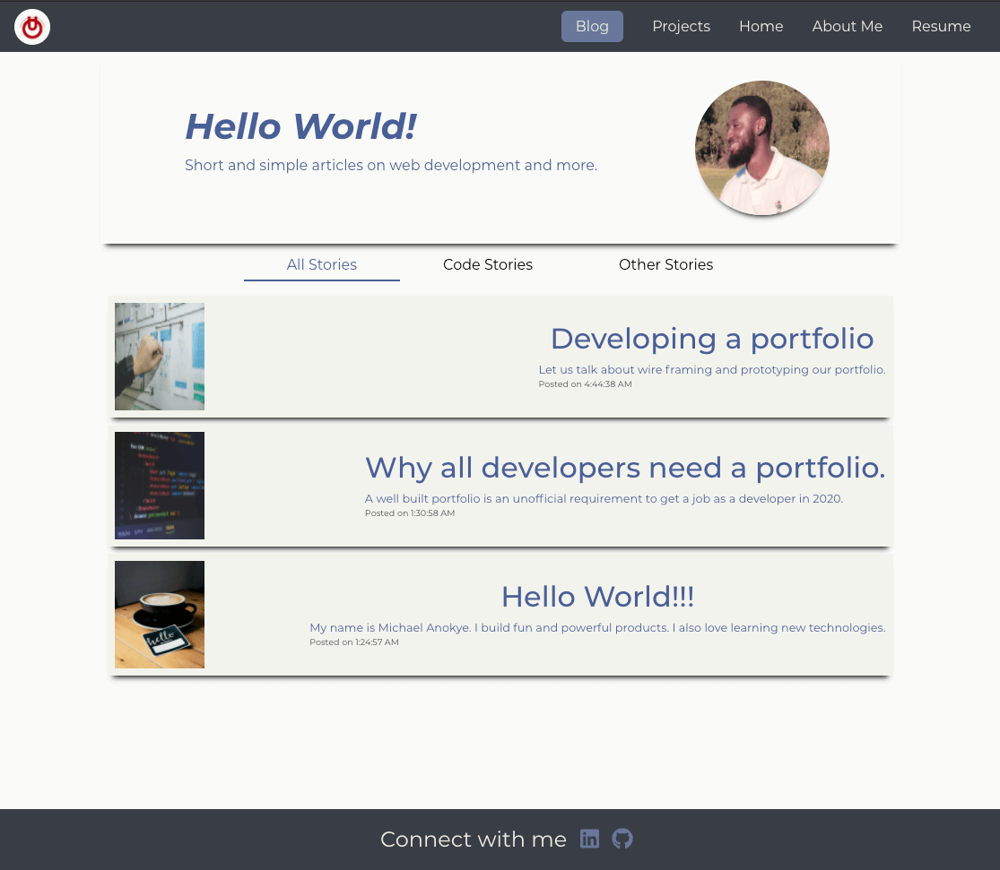
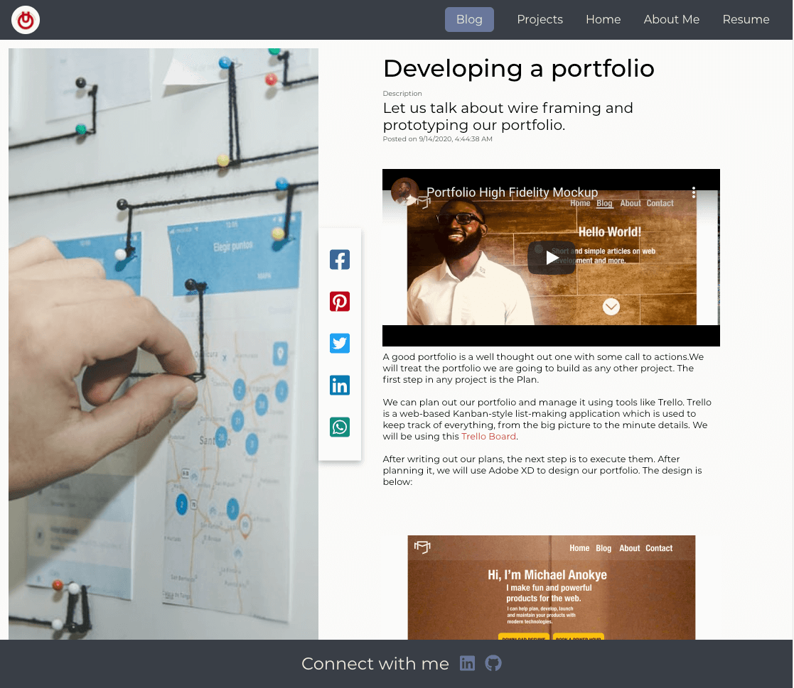

# My Portfolio

## Hello World

> Multi-faceted software engineer who is knowledgeable in JavaScript, Python, MySQL, HTML, etc. 
> A true team player offering multiple years of experience in the software industry.
> Seeking the opportunity to provide outstanding, clean code in a collaborative environment.

#### Technology Used

> React, JavaScript, CSS, NPM
> [Check out my Portfolio](https://michaelanokye.com/ "Link to Wander App Landing page").

## Home Screen

> My portfolio welcomes you with a home screen where almost everything about me is summerized with a few projects and skills.
> 

## Blog Home Screen

> My blog page welcomes you with a home screen where you are presented with all stories beginning with the latest story.

> You can choose between "Code Stories" which are posts about tech and "Other Stories" which are posts about everything else.
> 

## Blog Details Screen

> My blog details page shows the actual blog post.
> 

### Contact Form

> You can reach out to me by submitting this form.
> 

### Resume

> The Resume page is where all detailed information about my experience and education can found.
> A pdf copy of my resume can also be downloaded here.
> 